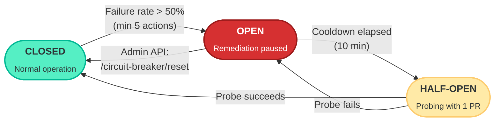

# Self-Healing PR Reconciliation System — Flow Diagrams

> Three complementary views of the AutoMergeMedic system: architecture, state lifecycle, and reconciler decision logic.

---

## 1. System Architecture Overview

How events flow through the system — from GitHub to bots — with the self-healing reconciler loop feeding remediation commands back through the same routing layer.

```mermaid
flowchart LR
    subgraph sources["Event Sources"]
        GH(["GitHub Webhooks<br/>PR · Check · Review"])
        CMT(["PR Comments<br/>/rebuild · /merge"])
        ADM(["Admin API<br/>POST /command"])
    end

    subgraph routing["Routing Layer"]
        CQ[["Command Queue<br/>(SQS)"]]
        CB{{"Car Bridge<br/>Lambda"}}
    end

    subgraph process["Event Processing"]
        EP["Event Processor<br/>Parse → Validate → Update"]
    end

    subgraph store["Data Store"]
        ST[("PR State<br/>Table")]
        ET[("PR Events<br/>Table")]
    end

    subgraph heal["Self-Healing Engine"]
        SCH["Scheduler<br/>(CodeGenie)"]
        REC["Reconciler"]
        CLS["Classification<br/>Engine"]
        CIR["Circuit<br/>Breaker"]
    end

    subgraph bots["Bot Ecosystem"]
        JK["Jenkins CI"]
        PB["Policy Bot"]
        AB["Approver Bot"]
        AM["Automerge Bot"]
    end

    GH -->|webhook| CB
    CMT -->|slash cmd| CQ
    ADM -->|command| CQ
    CQ --> CB

    CB -->|events| EP
    CB -->|/rebuild| JK
    CB -->|/recheck| PB
    CB -->|/approve| AB
    CB -->|/merge| AM

    EP --> ST
    EP --> ET

    SCH -->|triggers| REC
    ST -.->|reads stale PRs| REC
    REC <--> CLS
    REC <--> CIR
    REC -->|remediation cmds| CQ

    JK -.->|check events| GH
    PB -.->|status events| GH
    AB -.->|review events| GH
    AM -.->|merge events| GH

    classDef src fill:#74b9ff,stroke:#0984e3,color:#fff
    classDef rte fill:#a29bfe,stroke:#6c5ce7,color:#fff
    classDef prc fill:#55efc4,stroke:#00b894,color:#2d3436
    classDef sto fill:#ffeaa7,stroke:#fdcb6e,color:#2d3436
    classDef hlg fill:#ff7675,stroke:#d63031,color:#fff
    classDef bot fill:#dfe6e9,stroke:#636e72,color:#2d3436

    class GH,CMT,ADM src
    class CQ,CB rte
    class EP prc
    class ST,ET sto
    class SCH,REC,CLS,CIR hlg
    class JK,PB,AB,AM bot
```

**Key insight:** The reconciler doesn't call bots directly. It emits remediation commands to the same Command Queue used by humans and the Admin API. The Car Bridge routes everything — creating a single, consistent dispatch layer regardless of who initiated the action.

---

## 2. PR Lifecycle State Machine

The complete PR state machine with the happy path flowing top-to-bottom. Dashed lines show self-healing remediation loops triggered by the reconciler when a PR goes stale.

```mermaid
flowchart TD
    CREATED(["<b>CREATED</b><br/><sub>⏱ stale: 5 min</sub>"]):::init

    CHECKS_RUN(["<b>CHECKS_RUNNING</b><br/><sub>⏱ stale: 60 min</sub>"]):::active

    CHECKS_PASS(["<b>CHECKS_PASSED</b><br/><sub>Waiting for Policy Bot</sub>"]):::pass

    CHECKS_FAIL(["<b>CHECKS_FAILED</b><br/><sub>⏱ stale: 30 min</sub>"]):::fail

    POLICY_EVAL(["<b>POLICY_EVALUATING</b><br/><sub>⏱ stale: 30 min · can run at any pre-merge stage</sub>"]):::active

    POLICY_PASS(["<b>POLICY_PASSED</b><br/><sub>⏱ stale: 15 min</sub>"]):::pass

    POLICY_FAIL(["<b>POLICY_FAILED</b>"]):::fail

    APPROVED(["<b>APPROVED</b><br/><sub>⏱ stale: 10 min · SOD may run here</sub>"]):::pass

    MERGING(["<b>MERGING</b><br/><sub>⏱ stale: 5 min</sub>"]):::active

    MERGED(["<b>MERGED ✓</b><br/><sub>TTL: 24h soft-delete</sub>"]):::done
    CLOSED(["<b>CLOSED</b><br/><sub>TTL: 24h soft-delete</sub>"]):::shut
    NI(["<b>NEEDS INTERVENTION</b><br/><sub>Awaiting human</sub>"]):::alert

    %% ===== Happy Path =====
    CREATED -->|"CI checks begin"| CHECKS_RUN
    CHECKS_RUN -->|"All checks pass"| CHECKS_PASS
    CHECKS_PASS -->|"Policy Bot evaluates"| POLICY_EVAL
    POLICY_EVAL -->|"All policies met"| POLICY_PASS
    POLICY_PASS -->|"Approver Bot approves"| APPROVED
    APPROVED -->|"Automerge begins"| MERGING
    MERGING -->|"Merge succeeds"| MERGED

    %% ===== Failure Branches =====
    CHECKS_RUN -->|"Check fails / timeout"| CHECKS_FAIL
    POLICY_EVAL -->|"Policy violated<br/>(SOD · foreign commit · etc.)"| POLICY_FAIL
    APPROVED -.->|"🔄 Recheck SOD<br/>(max 1 · 2-approval repos)"| POLICY_EVAL

    %% ===== Merge Failure Paths =====
    MERGING -->|"Branch behind →<br/>auto-update"| CHECKS_RUN
    MERGING -->|"Merge conflicts"| CLOSED

    %% ===== SELF-HEALING: Transient Failure Remediation =====
    CHECKS_FAIL -.->|"🔄 Rebuild<br/>(max 3 retries)"| CHECKS_RUN
    CHECKS_FAIL -.->|"🔄 Update Branch<br/>(max 2 retries)"| CHECKS_RUN

    %% ===== SELF-HEALING: Close & Reopen =====
    CHECKS_FAIL -.->|"🔄 Close & Reopen<br/>(max 1 · conflicts)"| CLOSED
    CLOSED -.->|"New PR created<br/>for same vulnerability"| CREATED

    %% ===== SELF-HEALING: Stale Bot Detection =====
    CHECKS_PASS -.->|"🔄 Retrigger Policy Bot<br/>(max 2)"| POLICY_EVAL
    POLICY_FAIL -.->|"🔄 Retrigger Policy<br/>(max 2)"| POLICY_EVAL
    POLICY_FAIL -.->|"🔄 Recheck SOD<br/>(max 1)"| POLICY_EVAL
    POLICY_PASS -.->|"🔄 Retrigger Approver Bot<br/>(max 2)"| APPROVED
    APPROVED -.->|"🔄 Retrigger Automerge<br/>(max 2)"| MERGING

    %% ===== Permanent Policy Failure — Close (no reopen) =====
    POLICY_FAIL -->|"Permanent failure<br/>(foreign commit · invalid file)<br/>CodeGenie closes"| CLOSED

    %% ===== Escalation =====
    CHECKS_FAIL -->|"Persistent failure /<br/>budget exhausted"| NI
    POLICY_FAIL -->|"Unknown failure /<br/>budget exhausted"| NI

    %% ===== Styles =====
    classDef init fill:#a29bfe,stroke:#6c5ce7,color:#fff,stroke-width:2px
    classDef active fill:#74b9ff,stroke:#0984e3,color:#fff,stroke-width:2px
    classDef pass fill:#55efc4,stroke:#00b894,color:#2d3436,stroke-width:2px
    classDef fail fill:#ff7675,stroke:#d63031,color:#fff,stroke-width:2px
    classDef done fill:#00b894,stroke:#007a63,color:#fff,stroke-width:3px
    classDef shut fill:#636e72,stroke:#2d3436,color:#fff,stroke-width:2px
    classDef alert fill:#d63031,stroke:#9b1b1b,color:#fff,stroke-width:3px
```

### Legend

| Color | Meaning |
|-------|---------|
| 🟣 Purple | Initial state |
| 🔵 Blue | Active / in-progress |
| 🟢 Green | Passed / success gate |
| 🔴 Red | Failed state |
| 🟩 Dark green | Terminal success (merged) |
| ⬛ Gray | Terminal closed |
| 🟥 Dark red | Needs human intervention |
| ➡️ Solid arrows | Event-driven transitions |
| ⇢ Dashed arrows | Reconciler-driven self-healing |

### Retry Budget Summary

| Strategy | Max Retries | Triggered When |
|----------|-------------|----------------|
| Rebuild (retry checks) | 3 | Transient CI failure (timeout, infra) |
| Update Branch | 2 | Head branch behind base, no conflicts |
| Retrigger Policy Bot | 2 | Policy Bot stale after checks passed |
| Recheck SOD | 1 | Policy failed on SOD specifically |
| Retrigger Approver Bot | 2 | Approver Bot stale after policy passed |
| Retrigger Automerge | 2 | Automerge stale after approval |
| Recheck SOD (2-approval) | 1 | SOD failure after Approver Bot approval |
| Close PR (permanent) | 1 | Permanent policy failure (foreign commit, invalid file) — no reopen |
| Close & Reopen | 1 | Merge conflicts (destructive — one shot) |

> When any strategy's budget is exhausted and the PR is still stale → **NEEDS_INTERVENTION**.

---

## 3. Reconciler Decision Flow

The step-by-step logic the reconciler follows on each scheduled run. It queries for stale PRs, verifies against GitHub, classifies the failure, checks retry budgets, and dispatches the appropriate remediation — all behind a circuit breaker.

### Circuit Breaker States

---

## Command Queue Reference

Supported slash commands (from PR comments or Admin API):

| Command | Action | Routed To |
|---------|--------|-----------|
| `/rebuild` | Retrigger Jenkins build | Jenkins API |
| `/recheck-policy` | Retrigger Policy Bot evaluation | Policy Bot |
| `/recheck-sod` | Retrigger SOD validation | SOD Validator |
| `/recheck-approval` | Retrigger Approver Bot | Approver Bot |
| `/merge` | Retrigger Automerge Bot | Automerge Bot |
| `/update-branch` | Merge base into head | GitHub API |
| `/close-and-reopen` | Close PR, create fresh one | GitHub API + CodeGenie |
| `/cancel` | Close PR, mark abandoned | GitHub API |
